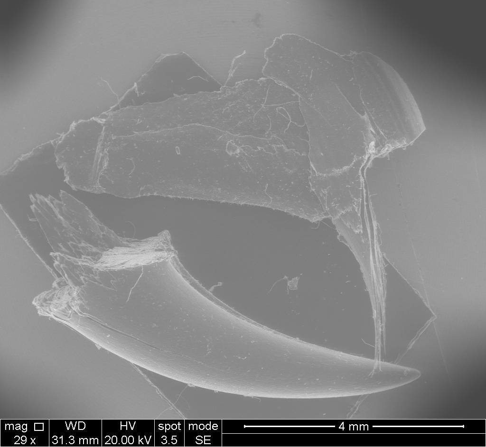

# _Kitty_'s Claw

The website at [https://www.seas.upenn.edu/~ericoc/kitty-claw/](https://www.seas.upenn.edu/~ericoc/kitty-claw/) hosts microscopic images taken of my cats (_Kitty_) claws using the:

**[_FEI Quanta 600 Field Emission Gun (FEG) Mark II Environmental Scanning Electron Microscope (ESEM)_](https://www.nano.upenn.edu/equipment/quanta-600-feg-esem/)**

Thank you to the the [_Nanoscale Characterization Facility (NCF)_](https://www.nano.upenn.edu/resources/nanoscale-characterization/)
at the [_Krishna P. Singh Center for Nanotechnology_](https://www.nano.upenn.edu/).
